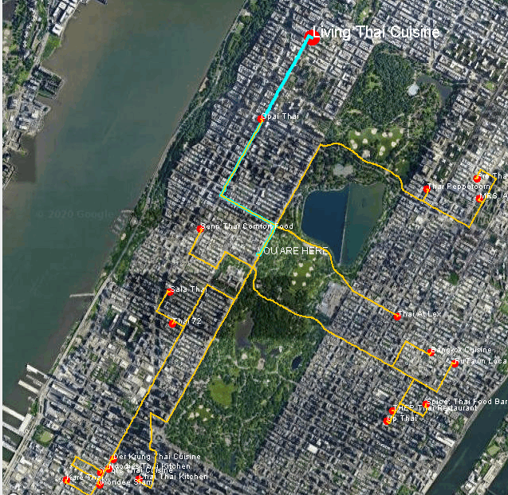
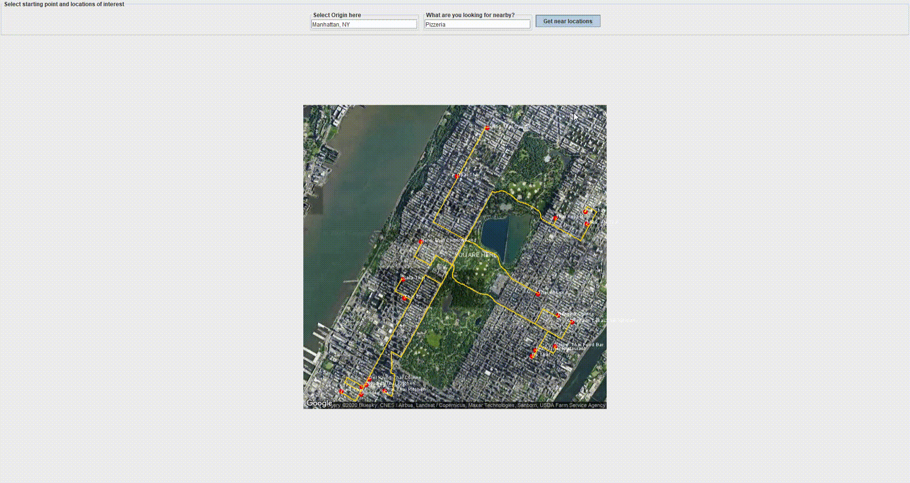
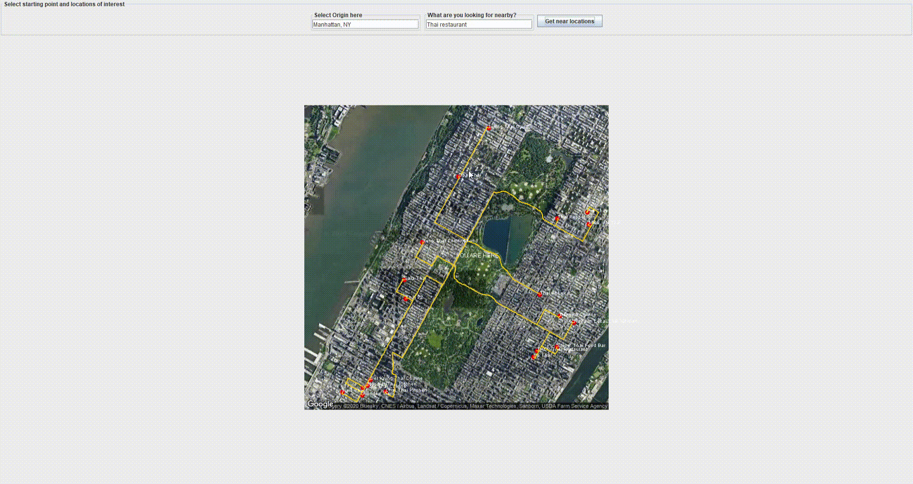
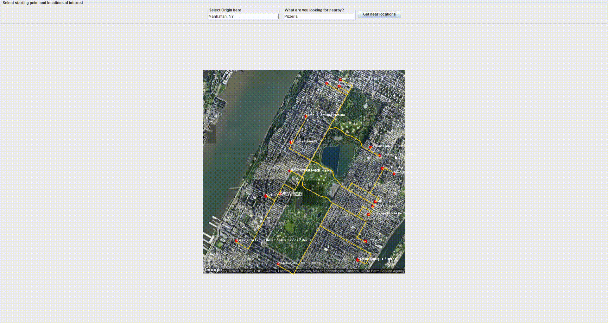

# Maps Visualization

 

    
  </a>

  

    A geo-spatial data and information Java desktop application 
  

<!-- TABLE OF CONTENTS -->
## Table of Contents

* [About the Project](#about-the-project)
  * [Built With](#built-with)
* [Usage](#usage)
* [Contributing](#contributing)
* [License](#license)

<!-- ABOUT THE PROJECT -->
## About The Project

* We are trying to create an Open-Source Desktop application to **handle and process Google Maps' API geo-spatial data**.

### Built With
* [Java](https://www.java.com/it/)
* [Swing](https://docs.oracle.com/javase/7/docs/api/javax/swing/package-summary.html)
* [Google Maps API](https://developers.google.com/maps/documentation?hl=it)

<!-- USAGE EXAMPLES -->
## Usage
* UNTIL NOW YOU CAN:
    * Enter an origin address.
    * Enter something you want to look for near you.
    * The application will query Google Maps' API and return a map image with all the possible destinations and their relative road path.
    
    * You can highlight a path by passing with the mouse on it's relative destination
    
    * Although zooming in and out is a thing, these have to be slightly bug-fixed
    

##  TODO
- [ ] Add more options
- [ ] Bug fixing
- [ ] Improve performances
- [ ] Improve UX and UI
- [ ] Add some geo-mapping tools
- [ ] ...

<!-- CONTRIBUTING -->
## Contributing

Contributions are what make the open source community such an amazing place to be learn, inspire, and create. Any contributions you make are **greatly appreciated**.

1. Fork the Project
2. Create your Feature Branch (`git checkout -b feature/AmazingFeature`)
3. Commit your Changes (`git commit -m 'Add some AmazingFeature'`)
4. Push to the Branch (`git push origin feature/AmazingFeature`)
5. Open a Pull Request

## Authors
* Main Authors
   * [Stefano Scolari](https://www.linkedin.com/in/stefano-scolari-7a9440170/) 
   * [Alessandro Mazzoli](https://github.com/alemazzo)

## License

- **[MIT license](http://opensource.org/licenses/mit-license.php)**

